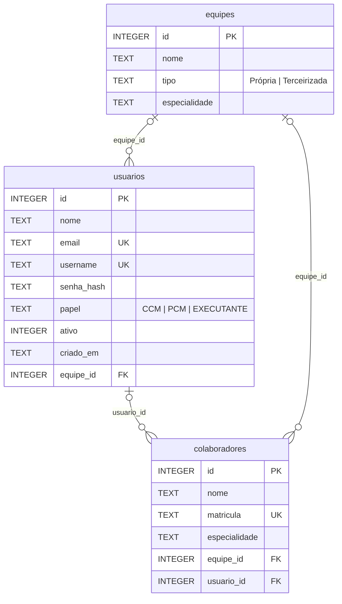
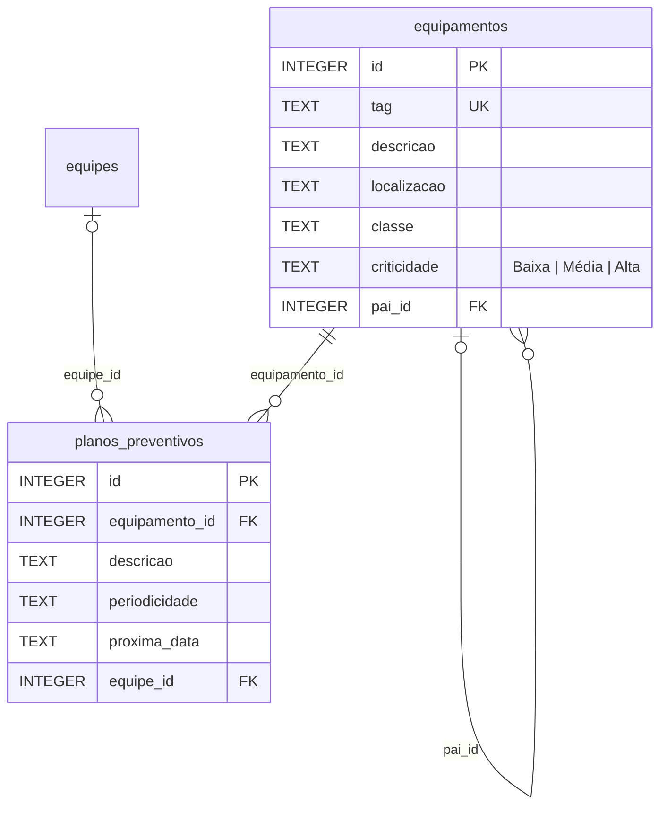
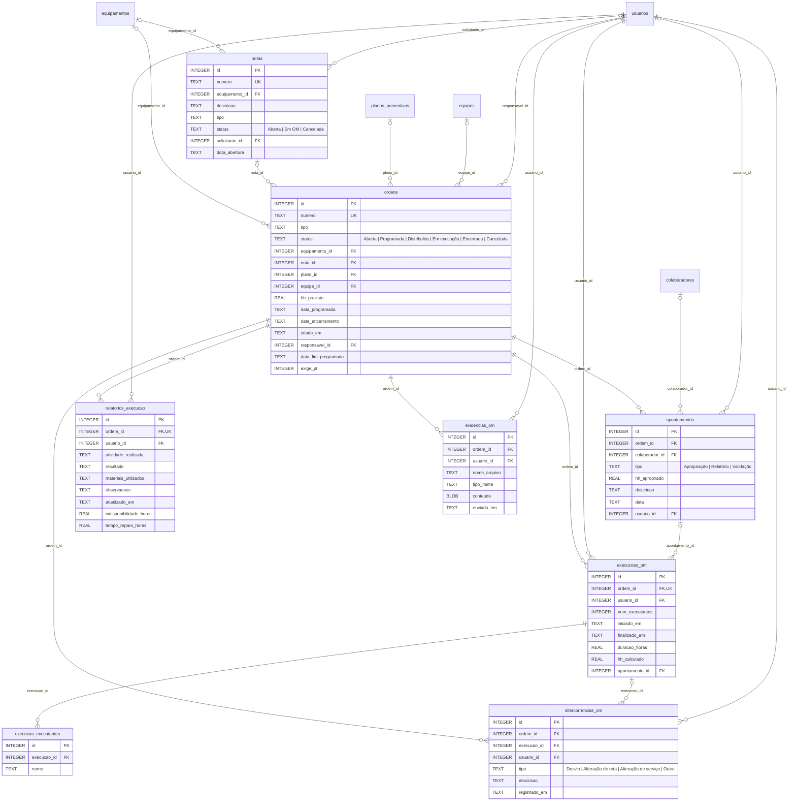
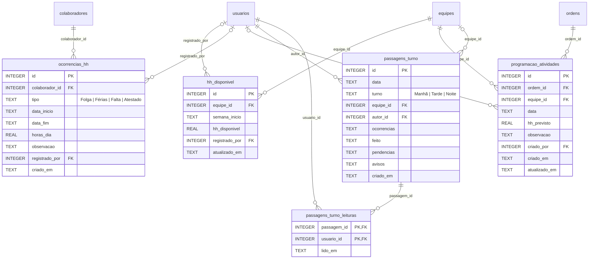
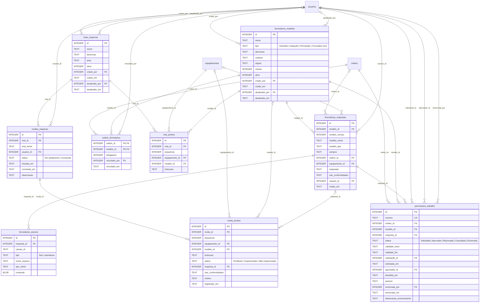
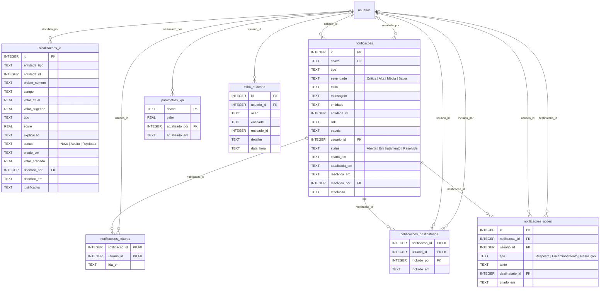
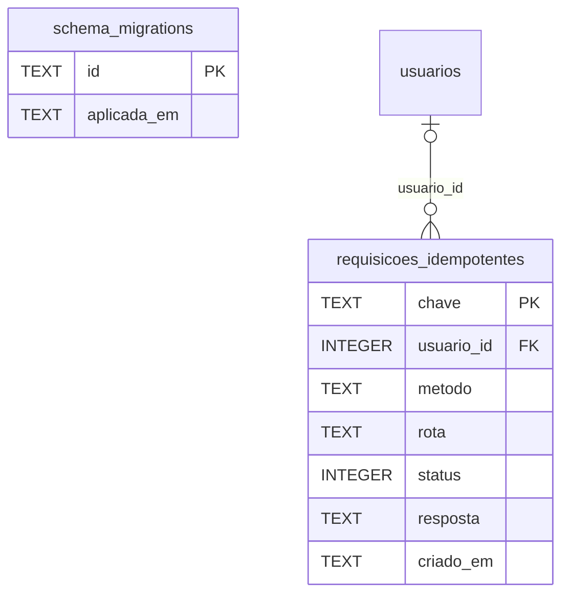

# Banco de dados do SIGMA·CCM

> Documento gerado por `server/scripts/gerar-doc-banco.js` a partir do esquema real (schema.sql + migrações).
> Não edite à mão: altere as descrições em `server/scripts/banco-de-dados.descricao.js` e rode o script.

**36 tabelas** em 7 módulos · 29 índices · 15 migrações · SQLite (WAL, chaves estrangeiras ligadas).

## Como o banco é criado e evolui

1. `server/schema.sql` cria as tabelas base (`CREATE TABLE IF NOT EXISTS`).
2. `server/src/data/migrations.js` aplica, em ordem, as migrações ainda não registradas em `schema_migrations`. Cada migração é idempotente e roda numa transação; nenhuma apaga dados, então o `.db` existente é sempre preservado.
3. `server/src/data/seed.js` faz a carga inicial: administrador do ambiente (produção) ou contas de exemplo (desenvolvimento) e, se `SIGMA_DEMO` estiver ligado, os dados de demonstração (uma única vez).
4. `docs/schema-completo.sql` é o DDL consolidado, gerado deste mesmo processo, para consulta e para recriar o banco em outra ferramenta.

## Camada de acesso a dados

Nenhuma rota ou serviço escreve SQL. Todo acesso ao banco passa por `server/src/data`:

| Arquivo | Papel |
|---|---|
| `data/connection.js` | Único módulo que conhece o driver (better-sqlite3): conexão, cache de instruções, `transaction()` e tradução de erros de restrição. |
| `data/migrations.js` | Estrutura do banco: schema.sql + migrações idempotentes. |
| `data/seed.js`, `data/seed-demo.js` | Carga inicial e dados de demonstração. |
| `data/repositories/*.js` | Um repositório por entidade, com funções de consulta e gravação (abaixo). |
| `data/index.js` | Ponto de entrada: `initDatabase()`, `transaction()` e os repositórios (`ordensRepo`, `usuariosRepo`…). |

Para trocar de banco (por exemplo, PostgreSQL), reimplemente apenas `server/src/data` mantendo os nomes e retornos das funções dos repositórios; rotas e serviços não mudam. O teste `server/test/arquitetura.test.js` impede SQL fora dessa pasta.

## Visão geral das relações

Para legibilidade, este diagrama omite as colunas de autoria que apontam para `usuarios` (`usuario_id`, `criado_por`, `registrado_por`, `responsavel_id`…); elas aparecem nos diagramas de cada módulo.

```mermaid
erDiagram
  equipes o|--o{ usuarios : "equipe_id"
  equipamentos o|--o{ equipamentos : "pai_id"
  equipes o|--o{ colaboradores : "equipe_id"
  equipes o|--o{ planos_preventivos : "equipe_id"
  equipamentos ||--o{ planos_preventivos : "equipamento_id"
  equipamentos o|--o{ notas : "equipamento_id"
  equipes o|--o{ ordens : "equipe_id"
  planos_preventivos o|--o{ ordens : "plano_id"
  notas o|--o{ ordens : "nota_id"
  equipamentos o|--o{ ordens : "equipamento_id"
  colaboradores o|--o{ apontamentos : "colaborador_id"
  ordens ||--o{ apontamentos : "ordem_id"
  colaboradores ||--o{ ocorrencias_hh : "colaborador_id"
  ordens ||--o{ relatorios_execucao : "ordem_id"
  ordens ||--o{ evidencias_om : "ordem_id"
  equipes ||--o{ hh_disponivel : "equipe_id"
  apontamentos o|--o{ execucoes_om : "apontamento_id"
  ordens ||--o{ execucoes_om : "ordem_id"
  execucoes_om ||--o{ execucao_executantes : "execucao_id"
  execucoes_om o|--o{ intercorrencias_om : "execucao_id"
  ordens ||--o{ intercorrencias_om : "ordem_id"
  equipes ||--o{ programacao_atividades : "equipe_id"
  ordens ||--o{ programacao_atividades : "ordem_id"
  equipes o|--o{ passagens_turno : "equipe_id"
  passagens_turno ||--o{ passagens_turno_leituras : "passagem_id"
  equipamentos o|--o{ formularios_respostas : "equipamento_id"
  ordens o|--o{ formularios_respostas : "ordem_id"
  formularios_modelos ||--o{ formularios_respostas : "modelo_id"
  formularios_respostas ||--o{ formularios_anexos : "resposta_id"
  formularios_modelos ||--o{ ordem_formularios : "modelo_id"
  ordens ||--o{ ordem_formularios : "ordem_id"
  formularios_modelos ||--o{ rota_pontos : "modelo_id"
  equipamentos ||--o{ rota_pontos : "equipamento_id"
  rotas_inspecao ||--o{ rota_pontos : "rota_id"
  rotas_inspecao ||--o{ rondas_inspecao : "rota_id"
  formularios_respostas o|--o{ ronda_pontos : "resposta_id"
  formularios_modelos o|--o{ ronda_pontos : "modelo_id"
  equipamentos o|--o{ ronda_pontos : "equipamento_id"
  rondas_inspecao ||--o{ ronda_pontos : "ronda_id"
  formularios_respostas ||--o{ permissoes_trabalho : "resposta_id"
  formularios_modelos ||--o{ permissoes_trabalho : "modelo_id"
  ordens ||--o{ permissoes_trabalho : "ordem_id"
  notificacoes ||--o{ notificacoes_leituras : "notificacao_id"
  notificacoes ||--o{ notificacoes_destinatarios : "notificacao_id"
  notificacoes ||--o{ notificacoes_acoes : "notificacao_id"
```

Ligações lógicas (sem chave estrangeira no banco):

- `sinalizacoes_ia.ordem_numero` → `ordens.numero`; `sinalizacoes_ia.entidade_id` → `apontamentos.id` quando `entidade_tipo = 'apontamento'`.
- `notificacoes.entidade` + `notificacoes.entidade_id` → registro de origem (`ordem`, `plano_preventivo`, `permissao_trabalho` ou `sinalizacao`).
- `trilha_auditoria.entidade` + `trilha_auditoria.entidade_id` → registro afetado pela ação.
- `rondas_inspecao.rota_nome`, `formularios_respostas.modelo_*` e `formularios_respostas.campos` são cópias congeladas (histórico preservado mesmo se a rota ou o modelo mudar).

## Módulos

### Acesso, pessoas e equipes

Quem usa o sistema e como as pessoas se organizam. Colaborador = usuário: cada usuário tem um vínculo em `colaboradores`, criado automaticamente.

#### `usuarios`

Usuários do sistema (login e perfil de acesso). Também são os colaboradores das equipes.

Repositório: `server/src/data/repositories/usuarios.js`

| Coluna | Tipo | Restrições | Padrão | Descrição |
|---|---|---|---|---|
| `id` | INTEGER | PK | — | Identificador (gerado automaticamente). |
| `nome` | TEXT | NOT NULL | — | Nome completo. |
| `email` | TEXT | UNIQUE | — | E-mail (opcional, único). |
| `username` | TEXT | UNIQUE, NOT NULL | — | Login (único). |
| `senha_hash` | TEXT | NOT NULL | — | Senha com hash bcrypt (nunca em texto). |
| `papel` | TEXT | NOT NULL | `'EXECUTANTE'` | Perfil de acesso (RBAC). · Valores: `CCM`, `PCM`, `EXECUTANTE` |
| `ativo` | INTEGER | NOT NULL | `1` | 1 = pode entrar no sistema; 0 = desativado. |
| `criado_em` | TEXT | NOT NULL | `datetime('now')` | Data/hora de cadastro (UTC). |
| `equipe_id` | INTEGER | FK | — | Equipe da pessoa. · → `equipes.id` |

Índices: `idx_usuarios_equipe`.

#### `equipes`

Equipes de manutenção, próprias ou terceirizadas.

Repositório: `server/src/data/repositories/equipes.js`

| Coluna | Tipo | Restrições | Padrão | Descrição |
|---|---|---|---|---|
| `id` | INTEGER | PK | — | Identificador (gerado automaticamente). |
| `nome` | TEXT | NOT NULL | — | Nome da equipe. |
| `tipo` | TEXT | NOT NULL | `'Própria'` | Vínculo da equipe. · Valores: `Própria`, `Terceirizada` |
| `especialidade` | TEXT | — | — | Especialidade principal. |

#### `colaboradores`

Vínculo de pessoa (colaborador = usuário). Ponte para ocorrências de HH e apontamentos antigos; sincronizado a partir de `usuarios`.

Repositório: `server/src/data/repositories/colaboradores.js`

| Coluna | Tipo | Restrições | Padrão | Descrição |
|---|---|---|---|---|
| `id` | INTEGER | PK | — | Identificador (gerado automaticamente). |
| `nome` | TEXT | NOT NULL | — | Nome. |
| `matricula` | TEXT | UNIQUE | — | Matrícula (única, opcional). |
| `especialidade` | TEXT | — | — | Especialidade. |
| `equipe_id` | INTEGER | FK | — | Equipe. · → `equipes.id` |
| `usuario_id` | INTEGER | FK | — | Usuário correspondente. · → `usuarios.id` |

Índices: `idx_colaboradores_usuario`.

### Ativos e planos de manutenção

Equipamentos (com hierarquia pai/filho e TAG única) e os planos preventivos que geram OMs.

#### `equipamentos`

Equipamentos (ativos) mantidos, com TAG única e hierarquia.

Repositório: `server/src/data/repositories/equipamentos.js`

| Coluna | Tipo | Restrições | Padrão | Descrição |
|---|---|---|---|---|
| `id` | INTEGER | PK | — | Identificador (gerado automaticamente). |
| `tag` | TEXT | UNIQUE, NOT NULL | — | TAG única (gerada pelo prefixo da classe, ex.: BOM-0001, ou manual). |
| `descricao` | TEXT | — | — | Descrição. |
| `localizacao` | TEXT | — | — | Área/local (filtro de área dos indicadores). |
| `classe` | TEXT | — | — | Classe (bomba, motor, painel…). |
| `criticidade` | TEXT | — | `'Média'` | Criticidade operacional. · Valores: `Baixa`, `Média`, `Alta` |
| `pai_id` | INTEGER | FK | — | Equipamento pai (hierarquia). · → `equipamentos.id` |

Índices: `idx_equipamentos_tag_unique`.

#### `planos_preventivos`

Planos de manutenção preventiva; geram OMs preventivas e notificações de vencimento.

Repositório: `server/src/data/repositories/planos.js`

| Coluna | Tipo | Restrições | Padrão | Descrição |
|---|---|---|---|---|
| `id` | INTEGER | PK | — | Identificador (gerado automaticamente). |
| `equipamento_id` | INTEGER | FK, NOT NULL | — | Equipamento do plano. · → `equipamentos.id` |
| `descricao` | TEXT | — | — | Atividade. |
| `periodicidade` | TEXT | — | — | Periodicidade (texto livre: Mensal, 500 horas…). |
| `proxima_data` | TEXT | — | — | Próxima execução (AAAA-MM-DD). |
| `equipe_id` | INTEGER | FK | — | Equipe responsável. · → `equipes.id` |

### Notas e ordens de manutenção

Fluxo principal: nota → OM → programação → distribuição → execução (cronômetro, intercorrências, evidências, relatório) → encerramento automático quando Apropriação, Relatório, Validação e checklists obrigatórios estão completos.

#### `notas`

Notas de manutenção (solicitações) que podem ser convertidas em OM.

Repositório: `server/src/data/repositories/notas.js`

| Coluna | Tipo | Restrições | Padrão | Descrição |
|---|---|---|---|---|
| `id` | INTEGER | PK | — | Identificador (gerado automaticamente). |
| `numero` | TEXT | UNIQUE, NOT NULL | — | Número sequencial da nota. |
| `equipamento_id` | INTEGER | FK | — | Equipamento. · → `equipamentos.id` |
| `descricao` | TEXT | NOT NULL | — | Problema relatado. |
| `tipo` | TEXT | NOT NULL | `'Corretiva'` | Tipo (Corretiva, Inspeção…). |
| `status` | TEXT | NOT NULL | `'Aberta'` | Situação. · Valores: `Aberta`, `Em OM`, `Cancelada` |
| `solicitante_id` | INTEGER | FK | — | Quem abriu. · → `usuarios.id` |
| `data_abertura` | TEXT | NOT NULL | `datetime('now')` | Data/hora de abertura (UTC). |

Índices: `idx_notas_status`.

#### `ordens`

Ordens de manutenção (OM), núcleo do sistema.

Repositório: `server/src/data/repositories/ordens.js`

| Coluna | Tipo | Restrições | Padrão | Descrição |
|---|---|---|---|---|
| `id` | INTEGER | PK | — | Identificador (gerado automaticamente). |
| `numero` | TEXT | UNIQUE, NOT NULL | — | Número sequencial da OM. |
| `tipo` | TEXT | NOT NULL | `'Corretiva'` | Corretiva, Preventiva, Inspeção… |
| `status` | TEXT | NOT NULL | `'Aberta'` | Etapa do fluxo da OM. · Valores: `Aberta`, `Programada`, `Distribuída`, `Em execução`, `Encerrada`, `Cancelada` |
| `equipamento_id` | INTEGER | FK | — | Equipamento. · → `equipamentos.id` |
| `nota_id` | INTEGER | FK | — | Nota de origem. · → `notas.id` |
| `plano_id` | INTEGER | FK | — | Plano de manutenção vinculado. · → `planos_preventivos.id` |
| `equipe_id` | INTEGER | FK | — | Equipe programada. · → `equipes.id` |
| `hh_previsto` | REAL | NOT NULL | `4` | HH previsto. |
| `data_programada` | TEXT | — | — | Início programado (AAAA-MM-DD). |
| `data_encerramento` | TEXT | — | — | Data de encerramento (DD/MM/AAAA). |
| `criado_em` | TEXT | NOT NULL | `datetime('now')` | Criação (UTC); base da janela dos indicadores. |
| `responsavel_id` | INTEGER | FK | — | Executante designado (distribuição). · → `usuarios.id` |
| `data_fim_programada` | TEXT | — | — | Término previsto (AAAA-MM-DD), quando a OM ocupa mais de um dia. |
| `exige_pt` | INTEGER | NOT NULL | `0` | 1 = só inicia com Permissão de Trabalho aprovada e vigente. |

Índices: `idx_ordens_status`, `idx_ordens_responsavel`, `idx_ordens_plano`.

#### `apontamentos`

Registros de execução da OM: as três condições de encerramento (um de cada tipo por OM).

Repositório: `server/src/data/repositories/apontamentos.js`

| Coluna | Tipo | Restrições | Padrão | Descrição |
|---|---|---|---|---|
| `id` | INTEGER | PK | — | Identificador (gerado automaticamente). |
| `ordem_id` | INTEGER | FK, NOT NULL | — | OM. · → `ordens.id` (ao excluir: CASCADE) |
| `colaborador_id` | INTEGER | FK | — | Colaborador (registros antigos). · → `colaboradores.id` |
| `tipo` | TEXT | NOT NULL | — | Condição registrada. · Valores: `Apropriação`, `Relatório`, `Validação` |
| `hh_apropriado` | REAL | NOT NULL | `0` | HH apropriado (Apropriação). |
| `descricao` | TEXT | — | — | Detalhe (ex.: cálculo do cronômetro). |
| `data` | TEXT | NOT NULL | `datetime('now')` | Momento do registro (UTC; pode vir do aparelho, offline). |
| `usuario_id` | INTEGER | FK | — | Quem registrou. · → `usuarios.id` |

Índices: `idx_apont_ordem`.

#### `relatorios_execucao`

Relatório de execução da OM (um por OM), com as durações usadas em disponibilidade, MTBF e MTTR.

Repositório: `server/src/data/repositories/relatoriosExecucao.js`

| Coluna | Tipo | Restrições | Padrão | Descrição |
|---|---|---|---|---|
| `id` | INTEGER | PK | — | Identificador (gerado automaticamente). |
| `ordem_id` | INTEGER | FK, UNIQUE, NOT NULL | — | OM (única). · → `ordens.id` (ao excluir: CASCADE) |
| `usuario_id` | INTEGER | FK, NOT NULL | — | Autor. · → `usuarios.id` |
| `atividade_realizada` | TEXT | NOT NULL | — | O que foi feito. |
| `resultado` | TEXT | — | — | Resultado. |
| `materiais_utilizados` | TEXT | — | — | Materiais. |
| `observacoes` | TEXT | — | — | Observações. |
| `atualizado_em` | TEXT | NOT NULL | `datetime('now')` | Última gravação (UTC). |
| `indisponibilidade_horas` | REAL | — | — | Horas de parada do equipamento. |
| `tempo_reparo_horas` | REAL | — | — | Horas de reparo (MTTR). |

#### `evidencias_om`

Imagens de evidência anexadas à OM pelo executante (até 5 MB cada).

Repositório: `server/src/data/repositories/evidencias.js`

| Coluna | Tipo | Restrições | Padrão | Descrição |
|---|---|---|---|---|
| `id` | INTEGER | PK | — | Identificador (gerado automaticamente). |
| `ordem_id` | INTEGER | FK, NOT NULL | — | OM. · → `ordens.id` (ao excluir: CASCADE) |
| `usuario_id` | INTEGER | FK, NOT NULL | — | Quem enviou. · → `usuarios.id` |
| `nome_arquivo` | TEXT | NOT NULL | — | Nome original. |
| `tipo_mime` | TEXT | NOT NULL | — | Tipo da imagem. |
| `conteudo` | BLOB | NOT NULL | — | Arquivo (binário). |
| `enviado_em` | TEXT | NOT NULL | `datetime('now')` | Envio (UTC). |

Índices: `idx_evidencias_ordem`.

#### `execucoes_om`

Execução cronometrada da OM (uma por OM). Ao finalizar, gera a Apropriação: HH = duração × executantes.

Repositório: `server/src/data/repositories/execucoes.js`

| Coluna | Tipo | Restrições | Padrão | Descrição |
|---|---|---|---|---|
| `id` | INTEGER | PK | — | Identificador (gerado automaticamente). |
| `ordem_id` | INTEGER | FK, UNIQUE, NOT NULL | — | OM (única). · → `ordens.id` (ao excluir: CASCADE) |
| `usuario_id` | INTEGER | FK, NOT NULL | — | Quem iniciou. · → `usuarios.id` |
| `num_executantes` | INTEGER | NOT NULL | — | Quantidade de executantes. |
| `iniciado_em` | TEXT | NOT NULL | `datetime('now')` | Início (UTC). |
| `finalizado_em` | TEXT | — | — | Fim (UTC); nulo = em andamento. |
| `duracao_horas` | REAL | — | — | Duração cronometrada. |
| `hh_calculado` | REAL | — | — | HH apropriado pela execução. |
| `apontamento_id` | INTEGER | FK | — | Apropriação gerada. · → `apontamentos.id` (ao excluir: SET NULL) |

#### `execucao_executantes`

Nomes dos executantes informados ao iniciar a execução.

Repositório: `server/src/data/repositories/execucoes.js`

| Coluna | Tipo | Restrições | Padrão | Descrição |
|---|---|---|---|---|
| `id` | INTEGER | PK | — | Identificador (gerado automaticamente). |
| `execucao_id` | INTEGER | FK, NOT NULL | — | Execução. · → `execucoes_om.id` (ao excluir: CASCADE) |
| `nome` | TEXT | NOT NULL | — | Nome do executante. |

Índices: `idx_execucao_executantes`.

#### `intercorrencias_om`

Intercorrências registradas em campo durante a execução (acompanhadas por PCM/CCM).

Repositório: `server/src/data/repositories/execucoes.js`

| Coluna | Tipo | Restrições | Padrão | Descrição |
|---|---|---|---|---|
| `id` | INTEGER | PK | — | Identificador (gerado automaticamente). |
| `ordem_id` | INTEGER | FK, NOT NULL | — | OM. · → `ordens.id` (ao excluir: CASCADE) |
| `execucao_id` | INTEGER | FK | — | Execução em andamento. · → `execucoes_om.id` (ao excluir: CASCADE) |
| `usuario_id` | INTEGER | FK, NOT NULL | — | Quem registrou. · → `usuarios.id` |
| `tipo` | TEXT | NOT NULL | — | Natureza da intercorrência. · Valores: `Desvio`, `Alteração de rota`, `Alteração de serviço`, `Outro` |
| `descricao` | TEXT | NOT NULL | — | Relato. |
| `registrado_em` | TEXT | NOT NULL | `datetime('now')` | Momento (UTC). |

Índices: `idx_intercorrencias_ordem`.

### Mão de obra, planejamento e turnos

Capacidade das equipes (HH disponível menos ocorrências), alocação semanal das OMs e passagem de turno com confirmação de leitura. Base do IAMOT e da aderência prevista.

#### `hh_disponivel`

HH disponível lançado por equipe e semana (denominador do IAMOT).

Repositório: `server/src/data/repositories/hhDisponivel.js`

| Coluna | Tipo | Restrições | Padrão | Descrição |
|---|---|---|---|---|
| `id` | INTEGER | PK | — | Identificador (gerado automaticamente). |
| `equipe_id` | INTEGER | FK, NOT NULL | — | Equipe. · → `equipes.id` |
| `semana_inicio` | TEXT | NOT NULL | — | Segunda-feira da semana (AAAA-MM-DD). |
| `hh_disponivel` | REAL | NOT NULL | — | Horas disponíveis da equipe na semana. |
| `registrado_por` | INTEGER | FK | — | Quem lançou. · → `usuarios.id` |
| `atualizado_em` | TEXT | NOT NULL | `datetime('now')` | Último lançamento (UTC). |

Chaves compostas: `UNIQUE (equipe_id, semana_inicio)`.
Índices: `idx_hh_disponivel_semana`.

#### `ocorrencias_hh`

Ausências que reduzem o HH disponível (enviadas pelo executante em campo). Atestado é dado sensível (LGPD): só o CCM vê o tipo.

Repositório: `server/src/data/repositories/ocorrencias.js`

| Coluna | Tipo | Restrições | Padrão | Descrição |
|---|---|---|---|---|
| `id` | INTEGER | PK | — | Identificador (gerado automaticamente). |
| `colaborador_id` | INTEGER | FK, NOT NULL | — | Pessoa ausente. · → `colaboradores.id` |
| `tipo` | TEXT | NOT NULL | — | Tipo de ausência. · Valores: `Folga`, `Férias`, `Falta`, `Atestado` |
| `data_inicio` | TEXT | — | — | Primeiro dia (AAAA-MM-DD). |
| `data_fim` | TEXT | — | — | Último dia (AAAA-MM-DD). |
| `horas_dia` | REAL | NOT NULL | `8` | Horas descontadas por dia útil. |
| `observacao` | TEXT | — | — | Observação. |
| `registrado_por` | INTEGER | FK | — | Quem enviou. · → `usuarios.id` |
| `criado_em` | TEXT | — | — | Envio (UTC). |

Índices: `idx_ocorrencias_colaborador`.

#### `programacao_atividades`

Alocação de HH de uma OM a uma equipe em um dia (planejamento semanal). Mantém as datas da OM sincronizadas.

Repositório: `server/src/data/repositories/programacao.js`

| Coluna | Tipo | Restrições | Padrão | Descrição |
|---|---|---|---|---|
| `id` | INTEGER | PK | — | Identificador (gerado automaticamente). |
| `ordem_id` | INTEGER | FK, NOT NULL | — | OM. · → `ordens.id` (ao excluir: CASCADE) |
| `equipe_id` | INTEGER | FK, NOT NULL | — | Equipe alocada. · → `equipes.id` |
| `data` | TEXT | NOT NULL | — | Dia (AAAA-MM-DD). |
| `hh_previsto` | REAL | NOT NULL | — | HH alocado no dia. |
| `observacao` | TEXT | — | — | Observação. |
| `criado_por` | INTEGER | FK | — | Quem alocou. · → `usuarios.id` |
| `criado_em` | TEXT | NOT NULL | `datetime('now')` | Criação (UTC). |
| `atualizado_em` | TEXT | — | — | Última alteração (UTC). |

Índices: `idx_programacao_data`, `idx_programacao_ordem`.

#### `passagens_turno`

Passagem de turno estruturada e imutável.

Repositório: `server/src/data/repositories/passagens.js`

| Coluna | Tipo | Restrições | Padrão | Descrição |
|---|---|---|---|---|
| `id` | INTEGER | PK | — | Identificador (gerado automaticamente). |
| `data` | TEXT | NOT NULL | — | Data do turno (AAAA-MM-DD). |
| `turno` | TEXT | NOT NULL | — | Turno. · Valores: `Manhã`, `Tarde`, `Noite` |
| `equipe_id` | INTEGER | FK | — | Equipe. · → `equipes.id` |
| `autor_id` | INTEGER | FK, NOT NULL | — | Quem passou o turno. · → `usuarios.id` |
| `ocorrencias` | TEXT | — | — | Ocorrências do turno. |
| `feito` | TEXT | NOT NULL | — | O que foi feito. |
| `pendencias` | TEXT | — | — | Pendências para o próximo turno. |
| `avisos` | TEXT | — | — | Avisos de segurança/operação. |
| `criado_em` | TEXT | NOT NULL | `datetime('now')` | Registro (UTC). |

Índices: `idx_passagens_data`.

#### `passagens_turno_leituras`

Confirmação de leitura de cada passagem de turno, por usuário.

Repositório: `server/src/data/repositories/passagens.js`

| Coluna | Tipo | Restrições | Padrão | Descrição |
|---|---|---|---|---|
| `passagem_id` | INTEGER | PK, FK | — | Passagem. · → `passagens_turno.id` (ao excluir: CASCADE) |
| `usuario_id` | INTEGER | PK, FK | — | Leitor. · → `usuarios.id` |
| `lido_em` | TEXT | NOT NULL | `datetime('now')` | Confirmação (UTC). |

Chaves compostas: `PK (passagem_id, usuario_id)`.

### Formulários, inspeções e permissões de trabalho

Motor No-Code de formulários (checklists, inspeções, APR/PT), rotas e rondas de inspeção e o fluxo de Permissão de Trabalho. As respostas guardam uma cópia do modelo na versão em que foram preenchidas.

#### `formularios_modelos`

Modelos de formulário criados no construtor No-Code. Cada alteração gera nova versão.

Repositório: `server/src/data/repositories/formularios.js`

| Coluna | Tipo | Restrições | Padrão | Descrição |
|---|---|---|---|---|
| `id` | INTEGER | PK | — | Identificador (gerado automaticamente). |
| `nome` | TEXT | NOT NULL | — | Nome. |
| `tipo` | TEXT | NOT NULL | — | Uso do formulário. · Valores: `Checklist`, `Inspeção`, `Permissão`, `Formulário livre` |
| `descricao` | TEXT | — | — | Descrição. |
| `campos` | TEXT | NOT NULL | — | JSON com os campos (tipo, obrigatoriedade, limites, condições). |
| `regras` | TEXT | NOT NULL | `'{}'` | JSON com regras de aplicação automática às OMs (tipos de OM, classes de equipamento, obrigatório). |
| `versao` | INTEGER | NOT NULL | `1` | Versão atual. |
| `ativo` | INTEGER | NOT NULL | `1` | 1 = disponível; 0 = desativado (preserva respostas). |
| `criado_por` | INTEGER | FK | — | Autor. · → `usuarios.id` |
| `criado_em` | TEXT | NOT NULL | `datetime('now')` | Criação (UTC). |
| `atualizado_por` | INTEGER | FK | — | Último editor. · → `usuarios.id` |
| `atualizado_em` | TEXT | — | — | Última edição (UTC). |

#### `formularios_respostas`

Respostas preenchidas, com o modelo congelado na versão usada e as não conformidades detectadas.

Repositório: `server/src/data/repositories/respostasFormulario.js`

| Coluna | Tipo | Restrições | Padrão | Descrição |
|---|---|---|---|---|
| `id` | INTEGER | PK | — | Identificador (gerado automaticamente). |
| `modelo_id` | INTEGER | FK, NOT NULL | — | Modelo. · → `formularios_modelos.id` |
| `modelo_versao` | INTEGER | NOT NULL | — | Versão do modelo no preenchimento. |
| `modelo_nome` | TEXT | NOT NULL | — | Nome do modelo (cópia). |
| `modelo_tipo` | TEXT | NOT NULL | — | Tipo do modelo (cópia). |
| `campos` | TEXT | NOT NULL | — | JSON dos campos (cópia). |
| `ordem_id` | INTEGER | FK | — | OM (opcional). · → `ordens.id` |
| `equipamento_id` | INTEGER | FK | — | Equipamento. · → `equipamentos.id` |
| `respostas` | TEXT | NOT NULL | — | JSON campo → valor. |
| `nao_conformidades` | TEXT | NOT NULL | `'[]'` | JSON com as não conformidades. |
| `usuario_id` | INTEGER | FK, NOT NULL | — | Quem preencheu. · → `usuarios.id` |
| `criado_em` | TEXT | NOT NULL | `datetime('now')` | Preenchimento (UTC; pode vir do aparelho). |

Índices: `idx_form_respostas_ordem`, `idx_form_respostas_equipamento`.

#### `formularios_anexos`

Fotos e assinaturas enviadas nas respostas.

Repositório: `server/src/data/repositories/respostasFormulario.js`

| Coluna | Tipo | Restrições | Padrão | Descrição |
|---|---|---|---|---|
| `id` | INTEGER | PK | — | Identificador (gerado automaticamente). |
| `resposta_id` | INTEGER | FK, NOT NULL | — | Resposta. · → `formularios_respostas.id` (ao excluir: CASCADE) |
| `campo_id` | TEXT | NOT NULL | — | Campo do modelo. |
| `tipo` | TEXT | NOT NULL | — | Tipo do anexo. · Valores: `foto`, `assinatura` |
| `nome_arquivo` | TEXT | NOT NULL | — | Nome original. |
| `tipo_mime` | TEXT | NOT NULL | — | Tipo da imagem. |
| `conteudo` | BLOB | NOT NULL | — | Arquivo (binário). |

Índices: `idx_form_anexos_resposta`.

#### `ordem_formularios`

Formulários vinculados manualmente a uma OM (checklist), obrigatórios ou não.

Repositório: `server/src/data/repositories/formularios.js`

| Coluna | Tipo | Restrições | Padrão | Descrição |
|---|---|---|---|---|
| `ordem_id` | INTEGER | PK, FK | — | OM. · → `ordens.id` (ao excluir: CASCADE) |
| `modelo_id` | INTEGER | PK, FK | — | Modelo. · → `formularios_modelos.id` |
| `obrigatorio` | INTEGER | NOT NULL | `0` | 1 = a OM só encerra com o formulário respondido. |
| `vinculado_por` | INTEGER | FK | — | Quem vinculou. · → `usuarios.id` |
| `vinculado_em` | TEXT | NOT NULL | `datetime('now')` | Vínculo (UTC). |

Chaves compostas: `PK (ordem_id, modelo_id)`.

#### `rotas_inspecao`

Rotas de inspeção: roteiro de pontos a percorrer.

Repositório: `server/src/data/repositories/rotasInspecao.js`

| Coluna | Tipo | Restrições | Padrão | Descrição |
|---|---|---|---|---|
| `id` | INTEGER | PK | — | Identificador (gerado automaticamente). |
| `nome` | TEXT | NOT NULL | — | Nome. |
| `descricao` | TEXT | — | — | Descrição. |
| `area` | TEXT | — | — | Área. |
| `ativo` | INTEGER | NOT NULL | `1` | 1 = disponível; 0 = desativada (preserva rondas). |
| `criado_por` | INTEGER | FK | — | Autor. · → `usuarios.id` |
| `criado_em` | TEXT | NOT NULL | `datetime('now')` | Criação (UTC). |
| `atualizado_por` | INTEGER | FK | — | Último editor. · → `usuarios.id` |
| `atualizado_em` | TEXT | — | — | Última edição (UTC). |

#### `rota_pontos`

Pontos da rota, em sequência: equipamento + formulário + instrução.

Repositório: `server/src/data/repositories/rotasInspecao.js`

| Coluna | Tipo | Restrições | Padrão | Descrição |
|---|---|---|---|---|
| `id` | INTEGER | PK | — | Identificador (gerado automaticamente). |
| `rota_id` | INTEGER | FK, NOT NULL | — | Rota. · → `rotas_inspecao.id` (ao excluir: CASCADE) |
| `sequencia` | INTEGER | NOT NULL | — | Ordem do ponto. |
| `equipamento_id` | INTEGER | FK, NOT NULL | — | Equipamento. · → `equipamentos.id` |
| `modelo_id` | INTEGER | FK, NOT NULL | — | Formulário de inspeção. · → `formularios_modelos.id` |
| `instrucao` | TEXT | — | — | Instrução ao inspetor. |

Índices: `idx_rota_pontos_rota`.

#### `rondas_inspecao`

Execução de uma rota por um inspetor (ronda).

Repositório: `server/src/data/repositories/rondasInspecao.js`

| Coluna | Tipo | Restrições | Padrão | Descrição |
|---|---|---|---|---|
| `id` | INTEGER | PK | — | Identificador (gerado automaticamente). |
| `rota_id` | INTEGER | FK, NOT NULL | — | Rota. · → `rotas_inspecao.id` |
| `rota_nome` | TEXT | NOT NULL | — | Nome da rota (cópia). |
| `usuario_id` | INTEGER | FK, NOT NULL | — | Inspetor. · → `usuarios.id` |
| `status` | TEXT | NOT NULL | `'Em andamento'` | Situação. · Valores: `Em andamento`, `Concluída` |
| `iniciada_em` | TEXT | NOT NULL | `datetime('now')` | Início (UTC). |
| `concluida_em` | TEXT | — | — | Conclusão (UTC). |
| `observacao` | TEXT | — | — | Observação final. |

Índices: `idx_rondas_usuario`.

#### `ronda_pontos`

Pontos da ronda (copiados da rota ao iniciar) e o resultado de cada um.

Repositório: `server/src/data/repositories/rondasInspecao.js`

| Coluna | Tipo | Restrições | Padrão | Descrição |
|---|---|---|---|---|
| `id` | INTEGER | PK | — | Identificador (gerado automaticamente). |
| `ronda_id` | INTEGER | FK, NOT NULL | — | Ronda. · → `rondas_inspecao.id` (ao excluir: CASCADE) |
| `sequencia` | INTEGER | NOT NULL | — | Ordem. |
| `equipamento_id` | INTEGER | FK | — | Equipamento. · → `equipamentos.id` |
| `modelo_id` | INTEGER | FK | — | Formulário. · → `formularios_modelos.id` |
| `instrucao` | TEXT | — | — | Instrução. |
| `status` | TEXT | NOT NULL | `'Pendente'` | Resultado do ponto. · Valores: `Pendente`, `Inspecionado`, `Não inspecionado` |
| `resposta_id` | INTEGER | FK | — | Resposta do formulário. · → `formularios_respostas.id` |
| `nao_conformidades` | TEXT | NOT NULL | `'[]'` | JSON com os desvios. |
| `motivo` | TEXT | — | — | Por que não foi inspecionado. |
| `registrado_em` | TEXT | — | — | Registro (UTC). |

Índices: `idx_ronda_pontos_ronda`.

#### `permissoes_trabalho`

Permissão de Trabalho (APR/PT) da OM, com validade de até 24 h e segregação de funções na aprovação.

Repositório: `server/src/data/repositories/permissoesTrabalho.js`

| Coluna | Tipo | Restrições | Padrão | Descrição |
|---|---|---|---|---|
| `id` | INTEGER | PK | — | Identificador (gerado automaticamente). |
| `numero` | TEXT | UNIQUE, NOT NULL | — | Número (PT-00001). |
| `ordem_id` | INTEGER | FK, NOT NULL | — | OM. · → `ordens.id` |
| `modelo_id` | INTEGER | FK, NOT NULL | — | Modelo da APR. · → `formularios_modelos.id` |
| `resposta_id` | INTEGER | FK, NOT NULL | — | APR preenchida. · → `formularios_respostas.id` |
| `status` | TEXT | NOT NULL | `'Solicitada'` | Situação. · Valores: `Solicitada`, `Aprovada`, `Reprovada`, `Cancelada`, `Encerrada` |
| `validade_inicio` | TEXT | NOT NULL | — | Início da validade (AAAA-MM-DDTHH:MM, local). |
| `validade_fim` | TEXT | NOT NULL | — | Fim da validade. |
| `solicitante_id` | INTEGER | FK, NOT NULL | — | Quem solicitou. · → `usuarios.id` |
| `solicitada_em` | TEXT | NOT NULL | `datetime('now')` | Solicitação (UTC). |
| `aprovador_id` | INTEGER | FK | — | Quem aprovou/reprovou. · → `usuarios.id` |
| `decidida_em` | TEXT | — | — | Decisão (UTC). |
| `parecer` | TEXT | — | — | Parecer/motivo. |
| `encerrada_por` | INTEGER | FK | — | Quem encerrou. · → `usuarios.id` |
| `encerrada_em` | TEXT | — | — | Encerramento (UTC). |
| `observacao_encerramento` | TEXT | — | — | Observação do encerramento. |

Índices: `idx_permissoes_ordem`.

### Qualidade de dados, notificações e governança

Sinalizações da IA com decisão humana, notificações de eventos críticos, metas dos KPIs e a trilha de auditoria (LGPD).

#### `sinalizacoes_ia`

Inconsistências detectadas pela IA com explicação (XAI) e a decisão humana (aceitar/rejeitar).

Repositório: `server/src/data/repositories/sinalizacoes.js`

| Coluna | Tipo | Restrições | Padrão | Descrição |
|---|---|---|---|---|
| `id` | INTEGER | PK | — | Identificador (gerado automaticamente). |
| `entidade_tipo` | TEXT | NOT NULL | `'apontamento'` | Tipo do registro sinalizado. |
| `entidade_id` | INTEGER | — | — | Registro sinalizado. |
| `ordem_numero` | TEXT | — | — | Número da OM. |
| `campo` | TEXT | — | — | Campo avaliado. |
| `valor_atual` | REAL | — | — | Valor registrado. |
| `valor_sugerido` | REAL | — | — | Valor sugerido pela IA. |
| `tipo` | TEXT | — | — | Tipo de inconsistência. |
| `score` | REAL | — | — | Confiança (0 a 1). |
| `explicacao` | TEXT | — | — | JSON com os fatores da decisão. |
| `status` | TEXT | NOT NULL | `'Nova'` | Situação. · Valores: `Nova`, `Aceita`, `Rejeitada` |
| `criado_em` | TEXT | NOT NULL | `datetime('now')` | Detecção (UTC). |
| `valor_aplicado` | REAL | — | — | Valor gravado ao aceitar. |
| `decidido_por` | INTEGER | FK | — | Quem decidiu. · → `usuarios.id` |
| `decidido_em` | TEXT | — | — | Decisão (UTC). |
| `justificativa` | TEXT | — | — | Justificativa da decisão. |

Índices: `idx_sinais_status`, `idx_sinais_entidade`.

#### `notificacoes`

Eventos críticos (OM atrasada, preventiva, PT pendente, inconsistência), gerados de forma idempotente e resolvidos automaticamente quando a condição some.

Repositório: `server/src/data/repositories/notificacoes.js`

| Coluna | Tipo | Restrições | Padrão | Descrição |
|---|---|---|---|---|
| `id` | INTEGER | PK | — | Identificador (gerado automaticamente). |
| `chave` | TEXT | UNIQUE, NOT NULL | — | Chave única do evento (evita duplicidade). |
| `tipo` | TEXT | NOT NULL | — | Tipo do evento. |
| `severidade` | TEXT | NOT NULL | — | Severidade. · Valores: `Crítica`, `Alta`, `Média`, `Baixa` |
| `titulo` | TEXT | NOT NULL | — | Título. |
| `mensagem` | TEXT | — | — | Mensagem. |
| `entidade` | TEXT | — | — | Tipo do registro de origem. |
| `entidade_id` | INTEGER | — | — | Registro de origem. |
| `link` | TEXT | — | — | Tela do sistema. |
| `papeis` | TEXT | NOT NULL | `'CCM,PCM'` | Perfis que veem (lista separada por vírgula). |
| `usuario_id` | INTEGER | FK | — | Destinatário direto. · → `usuarios.id` |
| `status` | TEXT | NOT NULL | `'Aberta'` | Situação. · Valores: `Aberta`, `Em tratamento`, `Resolvida` |
| `criada_em` | TEXT | NOT NULL | `datetime('now')` | Criação (UTC). |
| `atualizada_em` | TEXT | — | — | Última atualização (UTC). |
| `resolvida_em` | TEXT | — | — | Resolução (UTC). |
| `resolvida_por` | INTEGER | FK | — | Quem resolveu. · → `usuarios.id` |
| `resolucao` | TEXT | — | — | Como foi resolvida. |

Índices: `idx_notificacoes_status`, `idx_notificacoes_usuario`.

#### `notificacoes_leituras`

Leitura de notificação por usuário.

Repositório: `server/src/data/repositories/notificacoes.js`

| Coluna | Tipo | Restrições | Padrão | Descrição |
|---|---|---|---|---|
| `notificacao_id` | INTEGER | PK, FK | — | Notificação. · → `notificacoes.id` (ao excluir: CASCADE) |
| `usuario_id` | INTEGER | PK, FK | — | Leitor. · → `usuarios.id` |
| `lida_em` | TEXT | NOT NULL | `datetime('now')` | Leitura (UTC). |

Chaves compostas: `PK (notificacao_id, usuario_id)`.

#### `notificacoes_destinatarios`

Destinatários incluídos por encaminhamento.

Repositório: `server/src/data/repositories/notificacoes.js`

| Coluna | Tipo | Restrições | Padrão | Descrição |
|---|---|---|---|---|
| `notificacao_id` | INTEGER | PK, FK | — | Notificação. · → `notificacoes.id` (ao excluir: CASCADE) |
| `usuario_id` | INTEGER | PK, FK | — | Destinatário. · → `usuarios.id` |
| `incluido_por` | INTEGER | FK | — | Quem encaminhou. · → `usuarios.id` |
| `incluido_em` | TEXT | NOT NULL | `datetime('now')` | Encaminhamento (UTC). |

Chaves compostas: `PK (notificacao_id, usuario_id)`.

#### `notificacoes_acoes`

Histórico de tratamento da notificação (respostas, encaminhamentos e resolução).

Repositório: `server/src/data/repositories/notificacoes.js`

| Coluna | Tipo | Restrições | Padrão | Descrição |
|---|---|---|---|---|
| `id` | INTEGER | PK | — | Identificador (gerado automaticamente). |
| `notificacao_id` | INTEGER | FK, NOT NULL | — | Notificação. · → `notificacoes.id` (ao excluir: CASCADE) |
| `usuario_id` | INTEGER | FK, NOT NULL | — | Autor. · → `usuarios.id` |
| `tipo` | TEXT | NOT NULL | — | Ação. · Valores: `Resposta`, `Encaminhamento`, `Resolução` |
| `texto` | TEXT | — | — | Texto. |
| `destinatario_id` | INTEGER | FK | — | Destinatário do encaminhamento. · → `usuarios.id` |
| `criado_em` | TEXT | NOT NULL | `datetime('now')` | Registro (UTC). |

Índices: `idx_notificacoes_acoes`.

#### `parametros_kpi`

Metas e parâmetros de cálculo dos KPIs, editáveis pelo CCM (lista e limites em server/src/parametros.js).

Repositório: `server/src/data/repositories/parametros.js`

| Coluna | Tipo | Restrições | Padrão | Descrição |
|---|---|---|---|---|
| `chave` | TEXT | PK | — | Parâmetro (ex.: meta_disponibilidade). |
| `valor` | REAL | NOT NULL | — | Valor em vigor. |
| `atualizado_por` | INTEGER | FK | — | Quem alterou. · → `usuarios.id` |
| `atualizado_em` | TEXT | NOT NULL | `datetime('now')` | Alteração (UTC). |

#### `trilha_auditoria`

Trilha de auditoria (governança/LGPD): toda ação relevante, somente inclusão.

Repositório: `server/src/data/repositories/auditoria.js`

| Coluna | Tipo | Restrições | Padrão | Descrição |
|---|---|---|---|---|
| `id` | INTEGER | PK | — | Identificador (gerado automaticamente). |
| `usuario_id` | INTEGER | FK | — | Quem fez. · → `usuarios.id` |
| `acao` | TEXT | NOT NULL | — | Ação (ex.: criar_usuario, encerrar_auto). |
| `entidade` | TEXT | — | — | Tipo do registro afetado. |
| `entidade_id` | INTEGER | — | — | Registro afetado. |
| `detalhe` | TEXT | — | — | Resumo legível (sem dado sensível). |
| `data_hora` | TEXT | NOT NULL | `datetime('now')` | Momento (UTC). |

### Infraestrutura

Controle de versão do banco e suporte à operação offline.

#### `schema_migrations`

Migrações já aplicadas (e o marcador da carga de demonstração).

| Coluna | Tipo | Restrições | Padrão | Descrição |
|---|---|---|---|---|
| `id` | TEXT | PK | — | Id da migração. |
| `aplicada_em` | TEXT | NOT NULL | `datetime('now')` | Aplicação (UTC). |

#### `requisicoes_idempotentes`

Respostas dos envios da fila offline (X-Idempotency-Key), guardadas por 30 dias para que reenvios não repitam a operação.

Repositório: `server/src/data/repositories/idempotencia.js`

| Coluna | Tipo | Restrições | Padrão | Descrição |
|---|---|---|---|---|
| `chave` | TEXT | PK | — | Chave enviada pelo aparelho. |
| `usuario_id` | INTEGER | FK | — | Dono da chave. · → `usuarios.id` |
| `metodo` | TEXT | NOT NULL | — | Método HTTP. |
| `rota` | TEXT | NOT NULL | — | Rota chamada. |
| `status` | INTEGER | NOT NULL | — | Código HTTP da resposta original. |
| `resposta` | TEXT | — | — | Corpo JSON da resposta original. |
| `criado_em` | TEXT | NOT NULL | `datetime('now')` | Primeiro envio (UTC). |

Índices: `idx_requisicoes_idempotentes_data`.

## Migrações

| # | Id |
|---|---|
| 1 | `2026-10-02_additive_compatibility_columns` |
| 2 | `2026-10-02_equipment_tag_unique_index` |
| 3 | `2026-10-02_om_execution_and_evidence` |
| 4 | `2026-10-02_reliability_duration_fields` |
| 5 | `2026-10-02_labor_availability_and_user_team` |
| 6 | `2026-10-02_om_execution_timer` |
| 7 | `2026-10-02_users_as_collaborators` |
| 8 | `2026-10-02_order_schedule_end_date` |
| 9 | `2026-10-05_kpi_reference_parameters` |
| 10 | `2026-10-05_planning_and_shift_handover` |
| 11 | `2026-10-05_dynamic_forms` |
| 12 | `2026-10-05_inspection_routes_and_work_permits` |
| 13 | `2026-10-05_notifications` |
| 14 | `2026-10-05_offline_idempotency_keys` |
| 15 | `2026-10-05_data_quality_human_decision` |
